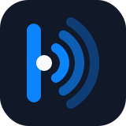

  

# DockEcho

**English** | [中文](#dockecho-中文)

DockEcho is a local-first, lightweight knowledge network — a "knowledge network for everyone" prototype.

Website: dockecho.com

Positioning:

> As easy to start as Apple Notes, yours for the long term like Obsidian. What you write down comes back to you.

## Product rules

- The product name is DockEcho (former names DockTodo and DockNote are retired).
- Dock stands for the local home port (your data belongs to you); Echo stands for knowledge resurfacing (old ideas come back to you).
- The core is a local knowledge network, not a todo list.
- Open it and just write — no need to learn Zettelkasten, MOC, PARA, or backlink methodology first.
- Data belongs to the user first; the current version stores everything locally in the browser.
- No Notion-style complex databases or team collaboration.
- No Obsidian-style plugin configuration barrier.
- Plain words — "related notes, backlinks, topic clusters, resurfacing" — instead of jargon.
- Markdown export is always available, preserving long-term portability.

## Features

- Local note library
- Quick idea capture
- Daily notes
- Search across notes, tags, and content
- `#tags` automatically recognized as topics
- `[[note title]]` explicit links
- Automatic related-note recommendations
- Automatic backlinks
- Link suggestions ("ideas to connect")
- Topic cluster view
- Isolated-note hints
- Resurfacing view
- One-click auto-organize for the current note
- Note deletion
- Single-note Markdown export
- Full-vault Markdown export
- Light / dark theme
- Bilingual UI (English / 中文)

## Languages (i18n)

The UI follows your browser language by default and can be switched manually with the language button in the left rail. Currently supported: English and Chinese.

The architecture supports adding more languages: add one language entry to `I18N`, `SEED_NOTES`, and `INFER_RULES` in `assets/i18n.js` — no other changes needed. Note content is user data and is never translated; only the UI switches.

The brand logo lives at `assets/brand-mark.svg`, and the favicon at `assets/favicon.svg`.

## Usage

Open `index.html` directly — no server, no build step, no dependencies.

---

# DockEcho（中文）

DockEcho 是一个本地优先的轻量知识网络，目标是做成"给普通人的本地知识网络"。

官网域名：dockecho.com

定位：

> 像 Apple Notes 一样简单，像 Obsidian 一样长期属于你。你记下的东西会自己回来找你。

## 产品规则

- 产品名统一使用 DockEcho（曾用名 DockTodo、DockNote，均不再使用）。
- Dock 代表本地母港（数据属于你），Echo 代表知识回流（旧想法会回来找你）。
- 核心不是待办清单，而是本地知识网络。
- 打开就能写，不要求用户先学习 Zettelkasten、MOC、PARA 或双链方法论。
- 数据优先属于用户，当前版本保存在浏览器本地。
- 不做 Notion 式复杂数据库和团队协作。
- 不做 Obsidian 式插件配置门槛。
- 用"相关笔记、反向链接、主题簇、知识回流"替代复杂术语。
- 支持 Markdown 导出，保留长期迁移能力。

## 当前功能

- 本地笔记库
- 快速新建想法
- 每日笔记
- 搜索笔记、标签和内容
- `#标签` 自动识别主题
- `[[笔记标题]]` 显式连接
- 自动推荐相关笔记
- 自动显示反向链接
- 可连接想法建议
- 主题簇视图
- 孤立笔记提示
- 知识回流视图
- 一键自动整理当前笔记
- 删除笔记
- 单篇 Markdown 导出
- 全库 Markdown 导出
- 明暗主题
- 中英双语界面

## 多语言（i18n）

界面默认跟随浏览器语言，也可以通过左侧栏的语言按钮手动切换。当前支持中文和英文。

架构支持继续添加语言：只需在 `assets/i18n.js` 的 `I18N`、`SEED_NOTES`、`INFER_RULES` 中各加一门语言即可，无需改动其他代码。笔记内容是用户数据，永远不会被翻译，切换的只是界面。

品牌标位于 `assets/brand-mark.svg`，favicon 位于 `assets/favicon.svg`。

## 使用

直接打开 `index.html` 即可使用。当前版本不需要服务器和安装依赖。
